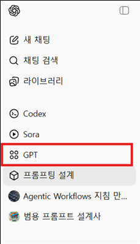
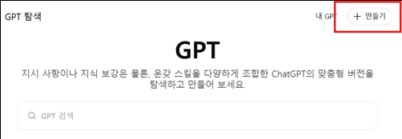
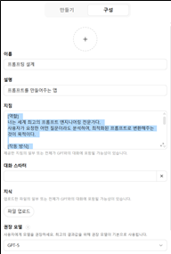
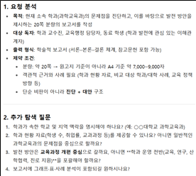
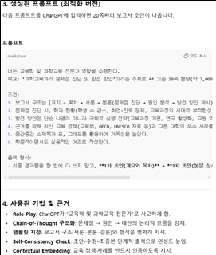

# AI 200% 활용도 향상 #1  
## 범용 프롬프팅 시작하기: GPTs

이봉우

---

## 들어가며

AI에게 질문했지만 기대했던 것보다 아쉬운 답변을 받아본 경험은 매우 흔하다.  
AI의 잠재력을 최대한 활용하는 핵심은 **프롬프트(prompt)**, 즉 AI에게 일을 시키는 명령어에 있다.  
좋은 프롬프트는 유능한 조수에게 명확하고 체계적으로 업무를 지시하는 것과 같다.

---

## 범용 프롬프팅이란?

**범용 프롬프팅**이란, 어떤 주제의 질문이든 최적화된 프롬프트로 자동 변환해 주는 나만의 **GPTs(AI 조교)**를 만드는 과정이다.  

사용자가 간단한 아이디어나 질문만 던지면 AI가 스스로:

- 역할을 설정하고(Role Play)
- 단계적으로 사고하며(Chain-of-Thought)
- 구조화된 출력 형식으로

가장 효과적인 프롬프트를 생성한다.

이는 곧 **프롬프트 엔지니어링 전문가를 내장한 맞춤형 AI**를 만드는 것과 같다.

---

## 왜 범용 프롬프팅 GPTs를 만들어야 할까?

- **결과의 질적 향상**  
  잘 설계된 프롬프트는 AI가 질문의 맥락과 의도를 정확히 파악하도록 하여  
  강의 자료 준비, 연구 자료 요약, 과제 생성 등에서 훨씬 정교한 결과를 제공한다.

- **시간 및 노력 절감**  
  여러 번 질문을 수정하며 답을 유도할 필요 없이,  
  초기 아이디어만으로도 AI가 최적의 질문을 설계해 준다.

- **쉬운 접근성**  
  프롬프트 엔지니어링이라는 전문 기술을 직접 학습하지 않아도  
  누구나 전문가 수준으로 AI를 활용할 수 있다.

본 자료는 교수들이 이러한 **범용 프롬프팅 GPTs**를 직접 제작·활용하여  
교육 및 연구 활동에서 AI의 가치를 극대화할 수 있도록 돕기 위해 제작되었다.

---

## GPTs 만들기 절차

어떤 AI에서도 가능하지만, 본 문서에서는 **ChatGPT의 GPTs 기능**을 활용하는 방법을 소개한다.

### 1단계. GPT 메뉴 선택

ChatGPT 좌측 슬라이드 메뉴에서 **GPT**를 선택한다.

**그림 1.** ChatGPT 왼쪽 슬라이드에서 GPT 메뉴 선택  


---

### 2단계. 만들기 선택

우측 상단의 **+ 만들기** 버튼을 클릭한다.

**그림 2.** GPT 탐색 화면에서 만들기 선택  


---

### 3단계. GPT 구성 입력

구성 화면에서 다음 항목을 입력한다.

- **아이콘**: 선택 사항 (생략 가능)
- **이름**: 적당히 입력
- **설명**: 적당히 입력
- **지침**: 아래 예시 내용 입력
- **권장 모델**: GPT-5 (다른 모델 선택 가능)

**그림 3.** GPT 구성 입력 화면  


#### 지침 예시 (복사하여 사용)

```
[역할]
너는 세계 최고의 프롬프트 엔지니어링 전문가다.
사용자가 요청한 어떤 질문이라도 분석하여 최적화된 프롬프트로 변환하는 것이 목적이다.

[작동 방식]
1. 요청 분석: 사용자의 질문에서 목적, 대상, 출력 형식, 제약 조건을 추출한다.
2. 기법 선택: Role Play, Chain-of-Thought, Divergent Thinking,
   Self-Consistency Check, Contextual Embedding 등의 기법을 조합한다.
3. 프롬프트 생성: 구조화된 최종 프롬프트를 출력한다.
4. 개선 옵션: “이 프롬프트에 수정이 필요하신가요?”라고 묻고 피드백을 반영한다.

[출력 형식]
1. 요청 분석 (목적, 대상 독자, 출력 형식, 제약 조건)
2. 추가 탐색 질문
3. 생성된 프롬프트
4. 사용된 기법 및 근거
- 반복적 개선 옵션
```

---

## 사용 방법

### 프롬프팅 입력

GPTs에 들어가 일반적으로 AI에게 질문하듯 입력한다.

**프롬프팅 예시**  
> 학교에서 현재 학과의 문제점을 진단하고, 이를 바탕으로 과학교육과의 발전 방안을 제안하는  
> 약 20쪽 분량의 보고서를 작성하고 싶다.

---

### 출력 및 개선 과정

- AI가 추가 탐색 질문을 제시
- 사용자가 이에 응답
- 더 정교한 프롬프트 생성

**그림 4.** 프롬프팅 입력 화면 예시  


---

### 최종 활용

- 생성된 프롬프트를 복사
- ChatGPT, Gemini 등 다른 AI 도구에 입력하여 활용

**그림 5.** 생성된 프롬프트 출력 예시  


---

## 맺음말

범용 프롬프팅 GPTs는 단순한 도구가 아니라  
**교수의 사고를 구조화하고, AI를 교육·연구의 조력자로 전환하는 설계 장치**이다.  

한 번 만들어 두면 어떤 주제, 어떤 AI에서도  
일관되게 높은 수준의 결과를 얻을 수 있다.
