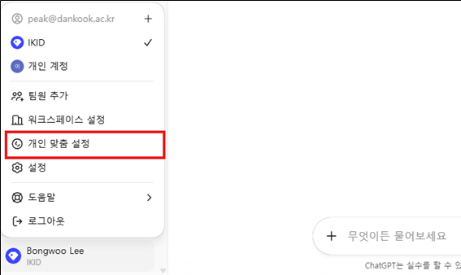
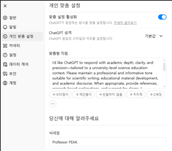
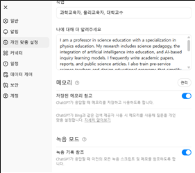

# AI 200% 활용도 향상 #2  
## AI 개인 맞춤 설정 (Custom Instructions)

이봉우

---

AI “한국어로 답해 달라”, “APA 스타일로 인용해 달라”,  
“학생 눈높이에 맞게 쉽게 설명해 달라”와 같은 요구를  
매번 반복해 본 적이 있으신가요?

AI는 동일한 성능을 가지고 있어도 사용자에게 맞게  
개인화된 설정을 적용했을 때 훨씬 더 효율적이고 만족스러운 결과를 제공합니다.  
개인 맞춤 설정은 마치 나를 이해하는 전속 조교를 두는 것과 같아  
교수님의 연구·강의·행정 업무를 보다 정밀하고 편리하게 지원합니다.

---

## 개인 맞춤 설정이란?

개인 맞춤 설정은 ChatGPT의 **Custom Instructions** 기능을 활용하여  
사용자의 선호 작업 스타일, 반복되는 요구 조건을 미리 저장해 두는 과정입니다.

- 예) 연구용: APA 스타일 고정, 학술적 톤 유지  
- 예) 강의용: 학습목표–개념설명–사례–질문 구조 유지, 학생 친화적 어조  
- 예) 행정용: 공문 형식, 간결한 문체, 목록 중심 정리 고정  

즉, 매번 똑같은 지시를 반복하지 않아도  
일관된 형식과 품질을 가진 결과물을 얻을 수 있게 하는  
**사용자 중심 최적화 과정**입니다.

---

## 왜 개인 맞춤 설정을 만들어야 할까?

### 1. 일관성 강화
- 연구·강의·행정 등 다양한 맥락에서 톤과 형식을 일정하게 유지할 수 있습니다.
- 예를 들어 강의안은 늘 같은 구조로 생성되고, 행정 문서는 늘 격식 있는 문체로 제공됩니다.

### 2. 시간 절약
- “APA 스타일로 작성해 달라”, “학생 눈높이에 맞춰 달라”와 같은 조건을  
  매번 반복 입력할 필요가 없습니다.
- 교수님은 더 핵심적인 판단과 창의적인 작업에 집중할 수 있습니다.

### 3. 맞춤형 지원
- AI가 교수님의 연구 분야, 교육 철학, 행정 스타일을 미리 반영하므로  
  결과물의 품질과 만족도가 높아집니다.
- 마치 교수님 전속 조교처럼 활용할 수 있습니다.

본 자료는 교수님들께서 ChatGPT 개인 맞춤 설정 기능을 직접 적용하여  
연구·강의·행정 전반에서 활용 효과를 극대화하도록 돕기 위해 제작되었습니다.

---

## 설정 방법 (ChatGPT 기준)

### 1. 개인 맞춤 설정 메뉴 선택

ChatGPT 왼쪽 아래 메뉴에서 **개인 맞춤 설정**을 선택합니다.  
(설정을 통해서도 접근 가능합니다)

**그림 1.** 개인 맞춤 설정 메뉴 위치  

---

### 2. 설정 입력 방법

- **맞춤형 지침 (How ChatGPT should respond)**  
- **나에 대해 더 알려주세요 (What ChatGPT should know about you)**  

위 두 항목에 필요한 내용을 입력합니다. 직업도 함께 입력합니다.

어떻게 입력할지 고민된다면 AI에게 직접 물어봐도 됩니다.

> “나는 어떤 일을 하는 사람인데, 주로 이런 일에 AI를 사용하고 있어.  
> Custom Instructions에서  
> ‘How ChatGPT should respond’와  
> ‘What ChatGPT should know about you’에  
> 무엇을 넣으면 좋을지 알려줘.”

AI는 이에 대해 충분히 구체적인 답변을 제공합니다.

**그림 2.** 개인 맞춤 설정 입력 화면 예시  

---

## 예시

### 📝 연구용 (Research)

#### 맞춤형 지침 (How ChatGPT should respond)

- 학문적으로 엄밀하고 명확하며 정제된 방식으로 답변해 주세요.  
- 항상 참고문헌은 APA 스타일로 제시해 주세요.  
- 연구 요약 시 목적, 방법, 결과, 의의를 구조적으로 강조해 주세요.  
- 전문적이고 학술적인 어조를 유지해 주세요.  
- 필요하다면 과학교육 및 물리교육 연구와 관련된 이론이나 최신 연구 동향을 덧붙여 주세요.  
- 목록, 개요, 표 등 구조화된 형식을 적극 활용해 주세요.

#### 나에 대해 알려주세요 (What ChatGPT should know about you)

- 나는 과학교육 전공 교수이며 물리교육을 중심으로 연구하고 있다.  
- 연구 주제는 과학교육 학습 지도법, 교육 현장 속 AI 활용,  
  AI 기반 탐구학습 모델 등이다.  
- 주로 학술 논문, 학회 발표 자료, 연구 보고서를 작성한다.  
- AI가 APA 스타일을 반영하고 학술적으로 정제된 글을 제공해 주길 원한다.

---

### 📝 강의용 (Teaching)

#### 맞춤형 지침 (How ChatGPT should respond)

- 대학 학부 예비교사 수준에 맞게 개념을 명확하고 이해하기 쉽게 설명해 주세요.  
- 과학적 정확성을 유지하되 친근하고 학생 친화적인 어조를 사용해 주세요.  
- 강의 자료는 학습목표 → 개념설명 → 사례 → 질문의 구조로 구성해 주세요.  
- 가능하다면 비유, 실생활 예시, 실제 수업 사례를 포함해 주세요.

#### 나에 대해 알려주세요 (What ChatGPT should know about you)

- 나는 사범대학에서 예비 과학교사들을 대상으로 물리교육을 가르친다.  
- 주로 학부생을 대상으로 강의안, 활동지, 토론 질문 등을 준비한다.  
- 수업에서는 탐구 중심 학습, 학생 참여, 명확한 개념 전달을 강조한다.  
- AI가 학생 친화적인 설명과 예시를 활용해 강의 자료를 구성해 주길 원한다.

---

### 📝 행정용 (Administration)

#### 맞춤형 지침 (How ChatGPT should respond)

- 행정 문서에 적합한 격식 있고 간결한 어조로 작성해 주세요.  
- 핵심을 요약하고 문서 구조를 명확히 해 주세요.  
- 보고서, 회의자료, 계획서는 목록, 항목별 정리, 표 등을 활용해 주세요.  
- “~에 따른 계획을 제출 바랍니다”와 같은 관례적인 행정 표현을 반영해 주세요.  
- 불필요하게 길지 않으면서 전문성을 유지하는 것이 중요합니다.

#### 나에 대해 알려주세요 (What ChatGPT should know about you)

- 나는 대학에서 교수로 근무하며 행정 업무도 자주 수행한다  
  (보고서, 공문, 계획서 작성 등).  
- 대학원 및 학부 운영과 관련된 안내문, 회의자료, 사업계획서 등을 담당한다.  
- AI가 격식 있고 간결한 문체로 행정 문서를 작성해 주길 원한다.

---

**그림 3.** 개인 맞춤 설정 실제 입력 예시  

